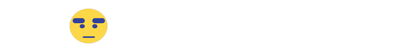

# BEB-06-FINAL-MODEKUNST

## ✏️ 프로젝트 컨셉

ModeKunst는 블록체인 기술을 활용한 토크노믹스가 구현된 패션 커뮤니티 서비스 입니다. 유저들은 커뮤니티에 적극적으로 참여해 마일리지와 토큰을 얻고 이를 바탕으로 양질의 정보를 재생산할 수 있으며 적절한 보상을 받을 수도 있습니다. 즉 토큰이라는 유인을 통해 유저의 적극적인 활동을 이끌어내고, 그 결과 양질의 정보를 재생산하는 선순환의 구조를 유지하는 것을 목표로 합니다.

## ✏️ 주요 기능

### 1. 메인 페이지

- 배너
  - 래플 및 기타 이벤트를 공지하는 영역
  - 커뮤니티 내 토큰 소각을 유도하는 매개체 역할
- 상단 게시물
  - 게시물 끌어올리기 기능을 통한 유저 주도 커뮤니티 조성
- 전체 게시물
  - 실시간으로 포스팅되는 게시물들을 나열

### 2. 게시글 페이지

- 게시물 좋아요 기능을 통해 마일리지 소비를 유도
- 게시물 좋아요 기능을 통해 게시글 페이지 내 추가적인 패션 정보를 열람 가능
  - 기본 패션 정보 = 시착 이미지와 유저들의 리뷰
  - 추가적인 패션 정보
    - 아우터, 상하의, 신발 별 브랜드 & 제품명 & 사이즈 정보
    - 시밀러 룩 정보(동일 카테고리 내 다른 유저가 업로드한 게시물 정보)

### 3. 유저 페이지

- 토큰을 소비해 특정 유저를 팔로우하면 해당 유저가 업로드하는 패션 정보를 구독
- 특정 유저의 다음과 같은 정보들을 열람 가능
  - 인기 게시물(좋아요 순) 목록
  - 보유 중인 NFT 목록
  - 좋아요 누른 게시물 목록
  - 팔로워 & 팔로잉 목록

### 4. 관리자 페이지

- 커뮤니티 악성 유저 관리 및 감독
- 메인 페이지 내 배너 관리(커뮤니티 이벤트 관리)
- 시즌 별 커뮤니티 우수 활동자에 대한 NFT 발급
- 유저 통계 및 현황
  - 가입자 성비
  - 게시글 좋아요 및 댓글 순위
  - 팔로워 보유 순위

### 5. 기타 페이지 기능 모음

- 회원가입 시 개인 지갑이 자동 생성되어 해당 지갑의 주소와 보유 중인 토큰량 및 NFT 목록을 별도로 관리
- 커뮤니티 유저 및 포스트 관련 CRUD 페이지 구현

## ✏️ 기술 스택

### 💻 FRONT

- ReactJS
- Axios
- Redux Toolkit
- Styled Components, TailwindCSS, Framer Motion

### 💻 BACK

- Express
- Mysql2 & Sequelize
- Nodemailer

### 💻 BLOCKCHAIN

- Web3.js
- Ganache, Solidity
- NFT Storage

### 💻 COMMUNICATION

- Github & Gitmoji
- Figma & Discord & Google Meet

## ✏️ 팀원 소개

- ✨ 이현종
  - BACK, BLOCKCHAIN
- ✨ 장형준
  - BACK, BLOCKCHAIN
- ✨ 김진영
  - FRONT, PRODUCT MANAGING
- ✨ 임진선
  - FRONT, PRODUCT MANAGING
